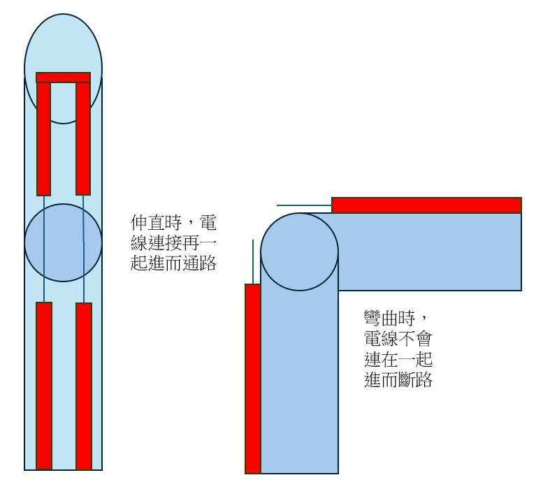

# 自選題企畫書

- 組員名稱：
  - B14901037 林孟希
  - B14901043 楊尚儒
  - B14901182 劉維元

## 一、自選題主題與動機

本專題希望透過影像辨識、三指控制手套與 Wi-Fi 連線，讓不同身體狀況的使用者能選擇適合自己的方式操控機器。許多身障者在日常生活中可能難以完成細緻操作，也因此限制了能操作的工具與能完成的動作。不同使用者的限制也不完全相同，有些人可能沒有手指或無法穩定做出手指動作，有些人則可能無法做出舉手超過肩膀的大動作。因此，本專題規劃使用兩種控制方式：一種透過影像辨識判斷手腕是否高過肩膀，另一種透過三指控制手套讀取手指彎曲狀態。車子再透過 Wi-Fi 與電腦或控制端連線，使使用者能依照自身能力選擇較適合的控制方式。

## 二、作法與預計達成目標

### Plan A：雙模式控制車子與爪子抓取垃圾

Plan A 預計製作一台可由影像辨識或三指控制手套操控的車子，並在車上加裝爪子與籃子，使車子能夠抓取地上的垃圾並放入籃子。兩種控制方式可滿足不同使用者的需求：若使用者不方便使用手指，可使用手腕超過肩膀的影像辨識控制；若使用者不方便舉手做大動作，則可使用三指控制手套。

預計作法如下：

1. 使用 Raspberry Pi Camera 擷取畫面，並以 MediaPipe 進行手部動作影像辨識。
2. 透過左右手手腕是否高過肩膀，控制車子前進及左右轉；若 Raspberry Pi 運算效能不足，則改由電腦端執行影像辨識。
3. 製作三指控制手套，透過三個微動開關偵測拇指、食指與中指是否彎曲。
4. 透過頭向前傾的動作或手套指令控制爪子，使爪子轉到固定角度、放下後抓取垃圾並放進籃子。
5. 使用 Wi-Fi 將車子與電腦或控制端連線，並在車上安裝 ESP32S。
6. 將原先的車子加大。
7. 製作機械手臂，並安裝在加大的車子上。

### 三指微動開關手套

三指控制手套是另一種控制模式，主要提供給不方便舉手或無法做出大幅度手臂動作的使用者。其感測原理是在手指關節處配置斷開的導線，當使用者伸直手指時，導線會因接觸而形成通路。此導通訊號由 Arduino 的類比輸入引腳捕捉後，透過 ESP32 模組無線傳輸至車體控制器，實現精確的遠端遙控。

三指控制可規劃如下：

| 按下狀態 | 控制指令 |
|---|---|
| 都沒按 | 停止 |
| 食指 | 前進 |
| 拇指 | 左轉 |
| 中指 | 右轉 |
| 拇指 + 中指 | 停止 |
| 食指 + 拇指 | 爪子放下 / 夾取 |
| 食指 + 中指 | 爪子收回 |
| 三指同時按下 | 緊急停止 |

### Plan B：機械手臂投球

Plan B 為備用方向，預計製作可前進、左右轉並使用手臂往前拋球的車子，手臂形式類似投石機。

控制方式原則上與 Plan A 相同，可使用影像辨識判斷手腕是否高過肩膀，也可使用三指控制手套讀取手指彎曲狀態。若三指控制手套製作上遇到困難或無法完成，Plan B 可改為只使用影像辨識的大動作控制，透過手腕是否高過肩膀來控制車子前進與左右轉。若時間允許，可能還會增加隨著出手速度來改變丟球速度的功能。

## 三、器材規劃

| 器材 | 用途 | 數量 / 說明 | 預估金額 |
|---|---|---|---:|
| SG90 與 MG90s 伺服馬達 | MeArm 機械手臂關節與爪子控制 | 8 個 (4 個備用) | 320 |
| M3 螺絲與螺帽組 | 組裝 MeArm 機械手臂 | M3 x 8 mm、10 mm、12 mm、20 mm 與螺帽各一批 | 100 |
| PCA9685 伺服驅動板 | 控制多顆伺服馬達 | 1 個 | 159 |
| ESP32S | Wi-Fi 連線與手套訊號讀取 | 1 個 | 140 |
| Raspberry Pi Camera 相容模組 | 影像擷取與動作辨識 | 1 個 | 300 |
| 手套 | 固定三指微動開關 | 1 雙 | 50 |
| 籃子 | 放置抓取到的垃圾 | 1 個 | 30 |
| 預備金 | 補買螺絲、螺帽或小零件 | 1 批 | 70 |

**預估總金額：NT$1.169**

## 四、時程規劃

| 週次 | 預計進度 |
|---|---|
| Week 12 | 完成自選題企畫書 |
| Week 13 | 完成硬體架設 |
| Week 14 | 完成硬體架設 / 軟體控制 |
| Week 15 | 完成軟體控制 |
| Week 16 | 製作海報 |
| Week 17 | 測試 + 成果發表 |

## 五、分工

| 組員 | 工作內容 |
|---|---|
| 林孟希 | 找機械手臂爪子資料、整理程式 |
| 楊尚儒 | 購買材料、組裝與繪製手臂設計圖 |
| 劉維元 | 撰寫基本程式、購買材料 |

## 六、預期成果

本專題預計完成一台可透過影像辨識、三指控制手套與 Wi-Fi 連線控制的車子。主要目標為提供兩種控制方式：手腕超過肩膀的影像辨識控制可提供給不方便使用手指的使用者，三指控制手套則可提供給不方便舉手做大動作的使用者。車子可依照控制指令前進、左右轉，並控制機械爪抓取地上垃圾，最後將垃圾放進車上的籃子中。

若 Plan A 執行上遇到困難，則改以 Plan B 的機械手臂投球作為備案，完成車子移動與手臂拋球控制。
