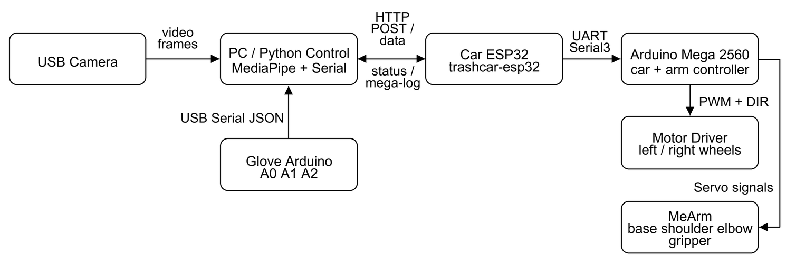
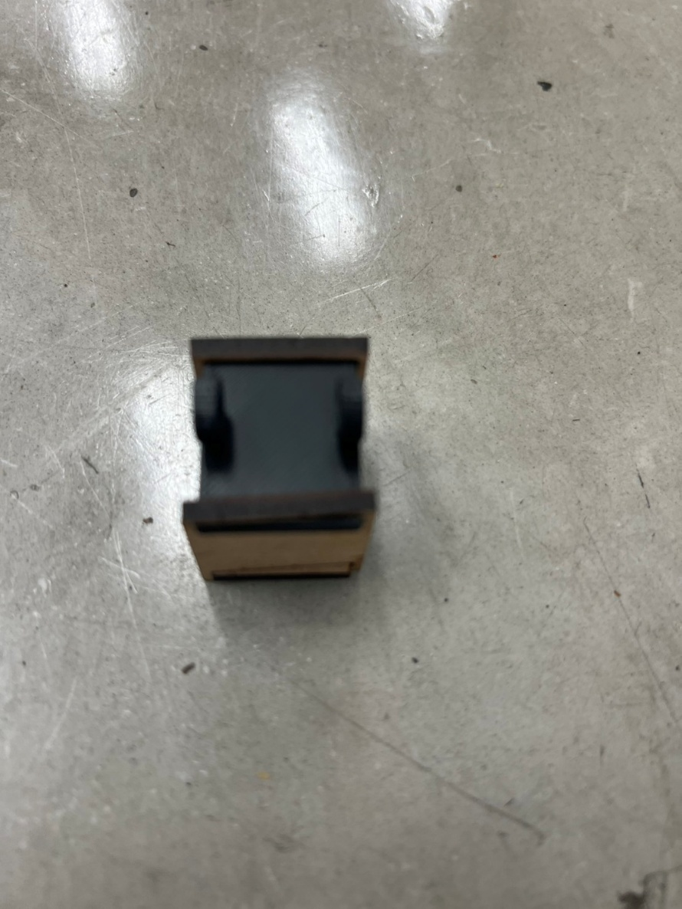
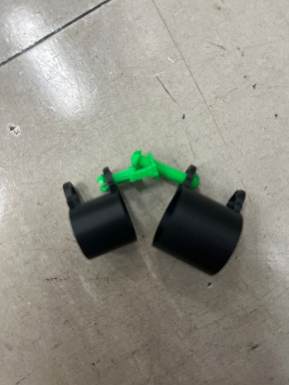
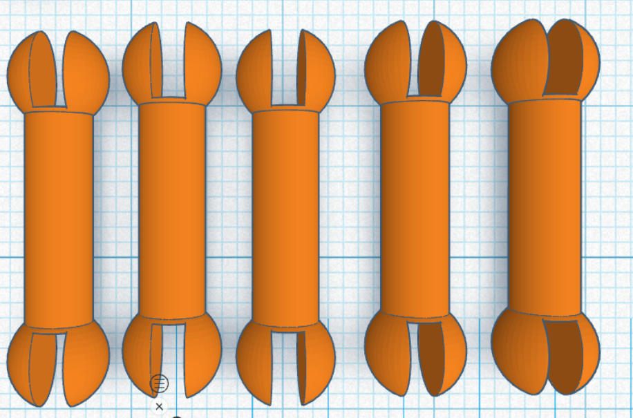
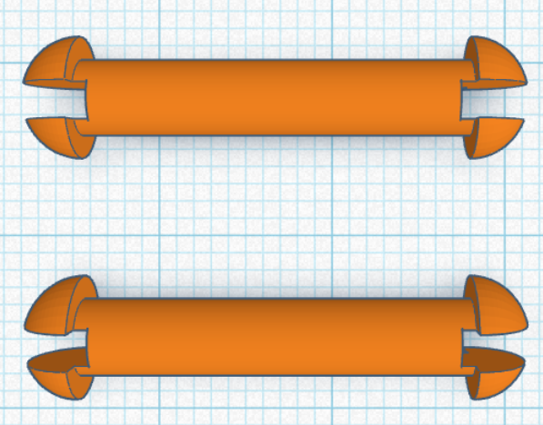
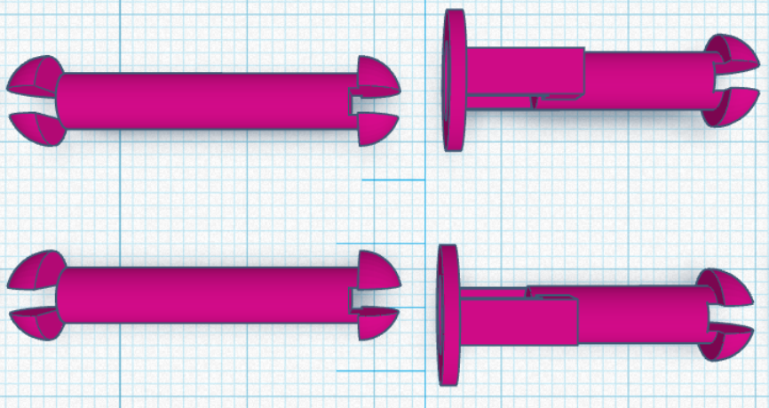

# 自選題 Documentation

## 1. 專案基本資料

- 專案名稱：NTUEE CarCar Course / 114 星期三下午第一組 Wi-Fi 影像手勢與手套控制垃圾車專案
- 組員名稱：
  - B14901037 林孟希
  - B14901043 楊尚儒
  - B14901182 劉維元
- 專案期間：2026 Spring week 12 ~ week 17
- 最後更新日期：2026-06-18

## 2. 專案簡介

### 2.1 專案概述

本自選題延伸指定題小車平台，將原本以循線、藍牙與 RFID 為主的自走車，改造成可由使用者動作直接控制的 Wi-Fi 遙控車與機械手臂系統。專案核心目標是提供不同身體狀況的使用者可選擇的操作方式：若使用者不方便進行細緻手指動作，可以透過影像辨識判斷左右手是否舉起來控制車輪；若使用者不方便長時間舉手，則可使用三指控制手套讀取手指彎曲狀態，進一步控制 MeArm 機械手臂與夾爪。

系統由 PC、車體 ESP32、Arduino Mega 2560、MeArm 機械手臂、三指手套與手套端 Arduino 組成。PC 端使用 MediaPipe Holistic 辨識姿勢與手部 landmarks，再透過 HTTP 將車輪與手臂指令送到車體 ESP32。ESP32 作為 Wi-Fi bridge，收到 `/data` 指令後轉發到 Mega 的 `Serial3`。Mega 同時控制左右輪馬達，以及最後展示中實際使用的 MeArm shoulder 與 gripper，使車子能前進、左右轉、停止，並能透過肩膀馬達與夾爪完成基本抓取動作。

專案主要由四個功能面組成：

- 影像控制：PC 使用攝影機與 MediaPipe Holistic 偵測左右手是否高過肩膀，將手勢轉換成前進、左轉、右轉與停止命令。
- Wi-Fi 指令橋接：ESP32 同時支援 station mode 與 direct AP mode，提供 `/status`、`/data`、`/mega-log` 與 UDP discovery，讓控制端能自動找到車子並送出命令。
- 車體與機械手臂控制：Arduino Mega 2560 接收輪子與手臂指令，控制馬達驅動板；MeArm 原先規劃控制 base、shoulder、elbow 與 gripper，最後展示完成 shoulder 與 gripper，base 轉向與 elbow 未完成整合控制。
- 三指手套控制：Arduino 讀取 A0/A1/A2 三路感測值，PC 端以門檻判斷 index、middle、ring 狀態，並映射到肩膀 jog 與夾爪開合。

### 2.2 專案目標

- 完成 ESP32 Wi-Fi bridge，讓 PC 能以 HTTP 指令控制 Mega。
- 支援 ESP32 direct AP 與手機熱點兩種連線模式，並能以 UDP discovery 自動尋找車子 IP。
- 使用 MediaPipe Holistic 進行即時影像辨識，將左右手舉起轉換成車輪控制命令。
- 將 MeArm 裝上車體，嘗試使用 Mega 控制 base、shoulder、elbow、gripper 四個伺服馬達；最後展示完成 shoulder 與 gripper，base 轉向與 elbow 未完成整合控制。
- 製作三指控制手套，透過 A0/A1/A2 讀取食指、中指、無名指的彎曲或接觸狀態。
- 完成影像辨識控制車輪、手套控制機械手臂的整合流程。
- 建立 dry-run、IP 測試、序列埠選擇與手動指令介面，方便在展示前逐步排錯。

## 3. 系統架構與設計

### 3.1 系統架構圖



圖中 MeArm 方塊表示安裝在車上的手臂模組；最後展示實際完成 shoulder jog 與 gripper open/close，base 轉向與 elbow 未完成整合控制。手套資料最後採用 Arduino USB Serial 直接送到 PC，沒有使用手套 ESP32 無線傳輸。

### 3.2 架構說明

PC 端是主要決策層。`mediapipe_wifi_control.py` 開啟攝影機並使用 MediaPipe Holistic 模型取得 pose 與 hand landmarks。程式會比較手腕與肩膀的相對位置，判斷左手、右手或雙手是否舉起：左手舉起代表左轉，右手舉起代表右轉，雙手舉起代表前進，沒有手勢則停止。為了避免每一幀都塞滿網路請求，程式以固定間隔送出最新命令，並在離線模式下可只測影像辨識而不控制車子。

車體端使用 ESP32 作為 Wi-Fi bridge。`src/esp32_bridge.cpp` 啟動 `TrashCar-ESP32` direct AP，也嘗試連到手機熱點。控制端可透過 `GET /status` 確認裝置名稱、station IP、AP IP 與 RSSI，透過 UDP port `4210` 廣播 `trashcar-discover` 自動找到目前 IP，再用 `POST /data` 送出純文字命令。ESP32 收到命令後以 `Serial2` 轉給 Mega `Serial3`，Mega 的回覆則被保存在 `/mega-log`，方便 PC 端確認手臂動作是否完成。

Arduino Mega 2560 同時是車體與機械手臂控制器。`src/mega2560_car_arm_controller.cpp` 支援兩種命令格式：一種是數字輪子命令，例如 `3 260 3 260` 代表左右輪慢速前進一段時間；另一種是文字手臂命令，例如 `set shoulder 90`、`jog shoulder 20 100`、`open`、`close`。Mega 端會為輪子與伺服馬達設定 timeout，避免網路或程式中斷後馬達持續運轉。

三指手套端以 Arduino 讀取 A0/A1/A2，分別代表食指、中指與無名指。`src/glove_arduino_reader.cpp` 每 40 ms 輸出 JSON，例如 `{"name":"trashcar-glove","seq":1,"index":650,"middle":390,"ring":360}`。最後展示時沒有使用手套 ESP32 傳輸資料，而是由 PC 端直接讀取手套 Arduino 的 USB Serial。整合程式 `vision_glove_arm_control.py` 則把影像控制車輪與手套控制手臂合併在同一個執行流程中。

### 3.3 影像辨識與手套整合策略

影像辨識控制的設計重點是讓使用者用大動作控制車輪，而把較精細的抓取動作交給手套。車輪控制只需要四種狀態，因此以手腕是否高過肩膀作為判斷條件，降低模型誤判對控制的影響。手勢映射如下：

```text
左手舉起 -> LEFT
右手舉起 -> RIGHT
兩手舉起 -> FORWARD
都沒舉   -> STOP
```

手套控制則使用門檻判斷與 edge trigger。食指、中指、無名指的類比值會因為接觸方式與分壓方向不同而有不同判斷條件，目前預設門檻如下：

```text
A0 / index  食指：> 630 算彎曲
A1 / middle 中指：< 420 算彎曲
A2 / ring   無名指：< 380 算彎曲
```

在整合模式中，中指彎曲一次代表肩膀向上 jog，食指彎曲一次代表肩膀向下 jog，無名指彎曲代表夾爪 close，無名指放開代表夾爪 open。肩膀使用 jog 而不是固定角度，是因為目前 MeArm 使用的連續旋轉伺服更適合以速度與時間控制。最後沒有完成 base 轉向與 elbow 的穩定控制，因此整合展示收斂在 shoulder jog 與 gripper open/close。整合程式保留 `--dry-run`、`--offline`、`--no-gripper`、`--list-ports` 等模式，讓影像、手套、車體、手臂可以分層測試。

## 4. 專案功能特點

- ESP32 車體橋接器提供 HTTP、UDP discovery 與 direct AP，能在 IP 改變時快速重新找到車子。
- PC 控制端可自動掃描 ESP32，也可指定 IP 或離線測試，展示前排錯成本較低。
- MediaPipe Holistic 同時使用 pose 與 hand landmarks，提高只有手掌或手腕可見時的判斷彈性。
- 車輪控制採用短時間脈衝命令，Mega 端也有 motor timeout，可降低連線中斷時持續暴衝的風險。
- Mega 端將車輪命令與手臂命令整合在同一個通道，HTTP `/data` 可同時控制移動與抓取。
- MeArm 伺服控制保留 `set`、`move`、`jog`、`pair`、`reach`、`open`、`close`、`stop all` 等測試命令；最後展示實際使用 shoulder jog 與 gripper open/close，base 與 elbow 未完成整合控制。
- 手套讀值支援 JSON 與 raw A0/A1/A2 格式，最後展示由 PC 直接讀取手套 Arduino 的 USB Serial。
- 整合程式使用背景 thread 傳送車輪與手臂命令，讓攝影機畫面、手套讀值與 HTTP 控制可以同時運作。
- 影像辨識結果會輸出成 mp4，方便展示後回看辨識狀態與指令反應。

## 5. 功能及組件說明

| 功能 / 組件 | 位置 | 說明 |
| --- | --- | --- |
| 影像 Wi-Fi 控車 | `mediapipe_wifi_control.py` | 使用 MediaPipe Holistic 判斷左右手是否舉起，並透過 HTTP POST 將輪子命令送到 ESP32。 |
| Holistic 模型與繪圖 | `whole_bode.py` | 管理 MediaPipe model 下載、Holistic landmarker 建立與 landmarks 繪製。 |
| 影像加手套整合 | `vision_glove_arm_control.py` | 同時執行影像車輪控制與三指手套手臂控制，是目前整合展示主程式。 |
| 進階影像手勢 | `holistic_gesture_vision.py` | 測試舉手、握拳、降手、滑鼠控制等額外手勢，並可選擇送出 ESP32 指令。 |
| 手臂 Wi-Fi CLI | `arm_wifi_control.py` | 提供互動式或單指令模式，手動送出 wheel、set、move、jog、open、close 等命令。 |
| 手套控車 | `glove_serial_car_control.py` | 從 Arduino Serial 讀取三指數值，依門檻轉換成前進、左轉、右轉或停止。 |
| 手套控手臂 | `glove_serial_arm_test.py` | 單獨測試手套控制肩膀 jog 與夾爪開合，可 dry-run 或實際送到車體 ESP32。 |
| 車體 ESP32 bridge | `src/esp32_bridge.cpp` | 啟動 Wi-Fi、HTTP server、UDP discovery，並將 `/data` 指令轉發到 Mega `Serial3`。 |
| Mega 車體與手臂控制 | `src/mega2560_car_arm_controller.cpp` | 控制左右輪與 MeArm 伺服命令 timeout；最後展示實際完成 shoulder 與 gripper 控制。 |
| 手套 Arduino reader | `src/glove_arduino_reader.cpp` | 讀取 A0/A1/A2，最後展示使用 USB Serial 將 `trashcar-glove` JSON 直接送到 PC。 |
| 手套 ESP32 sender | `src/glove_sender.cpp` | 原先規劃接收 Arduino JSON 並透過 UDP port `4211` 廣播手套資料；最後展示未使用，改採 USB Serial 直連 PC。 |
| 原始車體控制 | `src/mega2560_controller.cpp` | 較早期的 Mega 車輪控制韌體，保留作為單純車體控制版本。 |
| 硬體資料 | `hardware/mearm/v1/` | MeArm v1 組裝 PDF 與 DXF 檔案。 |

## 6. 專案資料夾結構

```text
Self_project/
├── mediapipe_wifi_control.py
├── vision_glove_arm_control.py
├── holistic_gesture_vision.py
├── glove_serial_car_control.py
├── glove_serial_arm_test.py
├── arm_wifi_control.py
├── whole_bode.py
├── platformio.ini
├── README.md
├── src/
│   ├── esp32_bridge.cpp
│   ├── mega2560_car_arm_controller.cpp
│   ├── mega2560_controller.cpp
│   ├── glove_arduino_reader.cpp
│   ├── glove_sender.cpp
│   ├── esp32_car_command_sender.cpp
│   ├── mega_command_relay.cpp
│   ├── mega2560_arm_test.cpp
│   ├── mega_pot_arm_controller.cpp
│   └── pot_threshold_tester.cpp
├── docs/
│   └── proposal/
├── hardware/
│   └── mearm/v1/
├── models/
└── legacy/
```

## 7. 開發環境與工具

- MCU：Arduino Mega 2560、ESP32、Arduino Uno 或 Mega 作為手套讀值板
- 韌體框架：Arduino Framework
- Build system：PlatformIO
- 主要 PlatformIO environments：`mega2560_car_arm`、`esp32_bridge`、`glove_arduino_mega`、`pot_threshold_tester`；`glove_sender` 為原先規劃無線手套時保留，最後展示未使用
- ESP32 platform：`espressif32@7.0.0`
- AVR platform：`atmelavr`
- Serial monitor speed：115200
- Arduino library：`arduino-libraries/Servo`
- Python：建議使用 Python 3.10 以上
- Python packages：`opencv-python`、`mediapipe`、`requests`、`pyserial`
- 主要硬體：USB Camera、ESP32S、Arduino Mega 2560、MeArm v1、SG90 / MG90s 伺服馬達、馬達驅動板、三指手套、導線接觸式感測器
- 網路模式：手機熱點 `Max`、ESP32 direct AP `TrashCar-ESP32`

## 8. 安裝與執行說明

### 8.1 安裝步驟

安裝 Python 套件：

```powershell
pip install opencv-python mediapipe requests pyserial
```

確認目前接到電腦的板子與序列埠：

```powershell
C:\Users\Max\.platformio\penv\Scripts\platformio.exe device list
```

編譯車體 ESP32 bridge：

```powershell
C:\Users\Max\.platformio\penv\Scripts\platformio.exe run -e esp32_bridge
```

編譯 Mega 車體與手臂控制韌體：

```powershell
C:\Users\Max\.platformio\penv\Scripts\platformio.exe run -e mega2560_car_arm
```

編譯手套 Arduino 讀值韌體：

```powershell
C:\Users\Max\.platformio\penv\Scripts\platformio.exe run -e glove_arduino_mega
```

### 8.2 執行範例

先確認 ESP32 是否在線，並自動尋找目前 IP：

```powershell
python .\mediapipe_wifi_control.py --ip auto --test-ip
```

若 PC 連到 ESP32 direct AP，可直接測試：

```powershell
python .\mediapipe_wifi_control.py --ip 192.168.4.1 --test-ip
```

只開影像辨識，不送車體指令：

```powershell
python .\mediapipe_wifi_control.py --offline --camera-index 0
```

使用影像辨識實際控制車子：

```powershell
python .\mediapipe_wifi_control.py --ip auto --camera-index 0
```

手動輸入手臂與車輪指令：

```powershell
python .\arm_wifi_control.py --ip 192.168.4.1 --no-confirm
```

常用手臂命令：

```text
jog shoulder 20 100
jog shoulder 120 1
set shoulder 90
open
close
stop all
log
quit
```

燒錄手套讀值韌體：

```powershell
C:\Users\Max\.platformio\penv\Scripts\platformio.exe run -e glove_arduino_mega -t upload --upload-port COM10
```

只看手套數值與門檻判斷：

```powershell
python .\glove_voltage_viewer.py --serial-port COM10
```

單獨測手套控制手臂，先 dry-run：

```powershell
python .\glove_serial_arm_test.py --serial-port COM10 --dry-run
```

實際用手套控制手臂：

```powershell
python .\glove_serial_arm_test.py --serial-port COM10 --car-ip auto
```

影像辨識控制車輪，手套控制手臂的整合展示：

```powershell
python .\vision_glove_arm_control.py --ip auto --serial-port COM10 --camera-index 0
```

若展示時暫時不讓無名指控制夾爪，可加上：

```powershell
python .\vision_glove_arm_control.py --ip auto --serial-port COM10 --camera-index 0 --no-gripper
```

展示指令整理：

手套讀值：只讀取手套 Arduino USB Serial，觀察 A0/A1/A2 數值與門檻判斷。

```powershell
python .\glove_voltage_viewer.py --serial-port COM10
```

手套加影像辨識：影像辨識控制車輪，手套 Arduino USB Serial 控制 shoulder 與 gripper。

```powershell
python .\vision_glove_arm_control.py --ip auto --serial-port COM10 --camera-index 0
```

全影像辨識：只使用攝影機與 MediaPipe 手勢辨識，並將指令送到車體 ESP32。

```powershell
python .\holistic_gesture_vision.py --send --ip auto --camera-index 0
```

## 9. 效能測試與功能驗證

### 9.1 已完成 Checklists

| 週次 | 項目 | 狀態 |
| --- | --- | --- |
| Week 12 | 完成自選題企畫書，確認影像辨識與三指手套方向 | 完成 |
| Week 12 | 整理 MeArm v1 組裝檔案與車體加裝構想 | 完成 |
| Week 13 | 建立 ESP32 Wi-Fi bridge，完成 `/status`、`/data` 與 direct AP | 完成 |
| Week 13 | 完成 PC 端 MediaPipe 影像辨識控制車輪 | 完成 |
| Week 13 | 完成 Mega 車輪命令接收與短時間馬達脈衝控制 | 完成 |
| Week 14 | 完成 MeArm 腳位配置與 shoulder / gripper 手動控制 CLI | 完成 |
| Week 14 | 完成 `arm_wifi_control.py` 互動式手臂測試流程 | 完成 |
| Week 14 | 完成三指手套 Arduino 讀值與 A0/A1/A2 門檻測試 | 完成 |
| Week 15 | 完成手套控制手臂 shoulder jog 與 gripper open/close | 完成 |
| Week 15 | 完成影像控制車輪加手套控制手臂整合程式 | 完成 |
| Week 15 | 完成 ESP32 IP 自動 discovery 與離線測試模式 | 完成 |
| Week 16 | 整理 README、測試指令與展示前排錯流程 | 完成 |

補充：最後展示中，手套資料沒有透過 ESP32 傳輸，而是由手套 Arduino 直接以 USB Serial 送到 PC；MeArm 也沒有完成 base 轉向與 elbow 的整合控制，實際完成範圍為 shoulder jog 與 gripper open/close。

### 9.2 測試紀錄表

| 測試項目 | 測試目的 | 方法 | 驗證方式 | 實測結果 |
| --- | --- | --- | --- | --- |
| PlatformIO build | 確認各韌體 environment 可編譯 | 執行 `platformio.exe run -e esp32_bridge`、`mega2560_car_arm`、`glove_arduino_mega` | 終端機顯示 build success，無 compile error | 完成 |
| ESP32 `/status` | 確認車體 ESP32 HTTP server 正常 | 執行 `python .\mediapipe_wifi_control.py --ip auto --test-ip` | 顯示 `trashcar-esp32` 與 HTTP 200 | 完成 |
| UDP discovery | 確認 PC 可在 IP 改變時找到車子 | 送出 `trashcar-discover` 到 UDP 4210 | ESP32 回覆目前 STA IP 與 AP IP | 完成 |
| HTTP `/data` 指令 | 確認 PC 指令可到達 ESP32 | 使用 `arm_wifi_control.py --command "stop all"` | ESP32 log 顯示 forward，Mega `/mega-log` 有回覆 | 完成 |
| Mega 輪子控制 | 確認左右輪可按時間脈衝運轉 | 送出 `3 260 3 260`、`3 120 2 0`、`2 0 3 120` | 車子可前進、左轉、右轉與停止 | 完成 |
| Mega motor timeout | 確認命令中斷時不持續運轉 | 停止 PC 端控制或送出 stop | Mega timeout 後馬達停止 | 完成 |
| MediaPipe offline | 確認攝影機與姿勢辨識可獨立測試 | 執行 `python .\mediapipe_wifi_control.py --offline` | 視窗顯示 landmarks 與目前手勢命令 | 完成 |
| 影像控車 | 確認左右手手勢可控制車輪 | 執行 `mediapipe_wifi_control.py --ip auto` | 左手左轉、右手右轉、雙手前進、無手停止 | 完成 |
| MeArm 手動控制 | 確認展示中使用的肩膀與夾爪可由 PC 控制 | 執行 `arm_wifi_control.py` 並輸入 `jog shoulder`、`open`、`close` | 手臂肩膀可移動，夾爪可開合；base 與 elbow 未完成整合控制 | 完成 |
| 手套 raw value | 確認 A0/A1/A2 讀值方向與門檻 | 執行 `glove_voltage_viewer.py` 或 Serial monitor | 食指、中指、無名指彎曲時數值跨過門檻 | 完成 |
| 手套 dry-run | 確認手套事件轉換成手臂命令 | 執行 `glove_serial_arm_test.py --dry-run` | 終端機顯示 jog shoulder、open、close | 完成 |
| 手套控手臂 | 確認手套可實際控制 MeArm 的展示功能 | 執行 `glove_serial_arm_test.py --car-ip auto` | 中指/食指觸發肩膀 jog，無名指控制夾爪；手套資料由 USB Serial 直接讀取 | 完成 |
| 整合展示 | 確認影像與手套可同時控制 | 執行 `vision_glove_arm_control.py --ip auto --serial-port COM10` | 攝影機畫面、車輪命令、手套狀態與 shoulder/gripper 狀態同步顯示 | 完成 |
| 影片輸出 | 確認展示過程可被記錄 | 執行影像控制程式 | 產生 `output_wifi_tracking.mp4` 或 `output_holistic_gesture_vision.mp4` | 完成 |

## 10. 遇到的挑戰、對應的解方以及未來改進方向

| 挑戰 | 當時觀察 | 對應解方 | 未來改進方向 |
| --- | --- | --- | --- |
| 車體 ESP32 使用舊 IP 後完全連不上 | 原先程式或筆記中的 `10.71.160.168` 逾時，後來 discovery 找到實際車體為 `trashcar-esp32`，當時 IP 是 `10.237.165.168` | 改用 `python .\mediapipe_wifi_control.py --ip auto --test-ip` 與 `GET /status` 確認車體，而不是重複嘗試舊 IP | 展示前先跑 IP discovery，避免把某一次測到的 IP 當成永久設定 |
| ESP32 測試指令一開始打錯參數 | 曾嘗試不存在的 `--test-esp32`，程式實際支援的是 `--test-ip` | 回頭檢查 `argparse` 與 README，統一使用 `--test-ip`、`--offline`、`--camera-index`、`--camera-backend` | 新增或修改 CLI 時同步更新 README，測試指令以程式實際 parser 為準 |
| 上傳韌體時出現 `avrdude`、timeout、`PermissionError(13)` 或 `FileNotFoundError` | 有時是板子型號與 env 不符，有時是 Serial monitor 或殘留程序占住 COM port，有時是拔插後 COM number 改變 | 先關閉 monitor，必要時拔插板子，再重新 `device list`；若是手套 Arduino Mega，使用 `glove_arduino_mega` 而不是 Uno env | 將「確認 env、確認 COM、確認沒有 monitor 占用」列為燒錄前固定步驟 |
| PC -> Mega -> ESP32 -> 車體 ESP32 relay chain 不容易一次成功 | 只燒錄其中一片板子或 TX/RX/GND 沒接正確時，PC 端看起來像命令沒有反應 | 拆成兩段驗證：先確認 Mega relay 能在 serial monitor 顯示輸入，再確認 relay ESP32 能 POST 到車體 `/data`；接線使用 Mega TX1 pin 18 -> ESP32 GPIO16、ESP32 GPIO17 -> Mega RX1 pin 19、共地並注意 level shifting | 之後只要 relay 失效，先檢查兩片板子的韌體 env、TX/RX 交叉接線、共地與 5V/3.3V 電平，不直接改上層 Python |
| MeArm shoulder 的方向與控制語意多次變動 | 一開始用一般伺服角度或連續旋轉伺服的假設都不完全符合實測，`reach up` / `reach down` 曾需要依照實際測到的方向重定義 | 先用 `arm_wifi_control.py` 手動送短 jog 或 set 指令測方向，再把結果寫進 wrapper；目前整合程式以 shoulder jog 與 stop speed 控制 | 之後更換伺服或改韌體前，先做單關節測試並記錄方向，不直接套用其他伺服的假設 |
| MeArm base 轉向與 elbow 控制沒有完成 | 原本希望四軸 MeArm 都能整合到展示流程，但最後穩定完成的是 shoulder jog 與 gripper open/close；base 轉向與 elbow 在展示前沒有完成可靠控制 | 將展示範圍收斂到已確認可動作的 shoulder 與 gripper，避免展示時因未穩定的關節造成整體流程失敗 | 後續應將 base 與 elbow 拆成單關節校正，先確認伺服種類、方向、角度或速度控制方式，再加入手套映射 |
| 可變電阻或手套類比值有雜訊與方向差異 | 先前 A0 大約在 613 到 684，A1 曾出現間歇性 0，A2 大約在 296 到 378；不同通道不能共用同一個判斷方向 | 先用 `pot_threshold_tester` 或 `glove_voltage_viewer.py` 只看 raw value，不驅動手臂；確認門檻後再使用 edge-trigger 控制 | 未來加入開機校正或 hysteresis，並把 A1 的 0 值視為接線或接觸問題優先檢查 |
| 手套資料最後沒有使用 ESP32 無線傳輸 | 原本規劃用手套 ESP32 透過 UDP 4211 廣播資料，但展示時 USB Serial 直連 PC 比較穩定，也較容易即時觀察 raw value | 最後改成 PC 直接讀手套 Arduino 的 USB Serial，再由整合程式把手套事件轉成手臂命令 | 若後續要讓手套完全無線化，再重新測試 glove ESP32 的封包格式、延遲、斷線重連與電源配置 |
| 伺服馬達無法順利帶動機械手臂 | 組裝後發現關節太緊，伺服馬達扭力不足以穩定帶動手臂 | 將機械手臂的螺絲稍微放鬆，降低關節摩擦，讓伺服馬達能比較順利帶動手臂 | 組裝時保留關節鬆緊調整流程，先測單顆伺服能否帶動負載，再進行整體組裝 |
| 影像辨識不容易辨識手指細微動作 | 手指細微動作在鏡頭與 MediaPipe 判斷上不夠穩定，容易造成誤判或辨識不到 | 改用 `pyautogui` 進行手勢輔助控制測試，並保留較大動作的影像控制作為車輪主要控制方式 | 若要控制細微動作，優先使用手套或實體感測器；影像辨識則保留給舉手、握拳等較明顯動作 |
| 爪子容易鬆脫，但直接用螺帽鎖住會卡到齒輪 | 爪子在動作時容易掉落；若用螺帽固定，螺帽會干涉帶動爪子旋轉的齒輪 | 改用較長的螺絲卡住爪子，並將爪子稍微黏住，避免掉落且不影響齒輪旋轉 | 後續可重新設計爪子固定座，讓固定點避開齒輪運動範圍 |
| 雷射切割指節厚度太厚，影響手套彎曲 | 一開始使用雷射切割製作指節，但 3 mm 厚度太粗，會限制手指彎曲程度 | 改用 3D 列印製作指節，並將厚度調整為約 0.3 mm | 後續可針對不同手指測試厚度與彈性，找出最不影響彎曲的結構 |
| 3D 列印關節的球狀結構容易斷裂或壓不下去 | 原本關節由完整球體與棒子接合，中間為空洞，球的部分不是太緊壓不下去，就是很容易斷掉 | 將完整球體改成半球與棒子結合，降低組裝難度並減少斷裂 | 後續可增加圓角與支撐面積，提升關節耐用度 |
| 單一關節的手套彎曲程度不足 | 一開始每根手指只設計一個關節，實際可彎曲角度有限 | 改成兩段式關節，讓手指彎曲時能有較大的總行程 | 後續可依照手指長度調整兩段關節比例，讓感測行程更穩定 |
| 線帶動齒輪再帶動可變電阻的機構無法有效傳動 | 原本打算用線帶動齒輪，再由齒輪帶動可變電阻旋轉，但與線連接的齒輪無法穩定帶動另一個齒輪 | 修改手套設計，將可變電阻放在關節附近，直接利用關節彎曲帶動可變電阻旋轉，不再使用線與齒輪傳動 | 後續可減少中間傳動零件，優先採用直接、短路徑的感測機構 |

| 附圖 | 對應問題 | 說明 |
| --- | --- | --- |
|  | 雷射切割指節厚度太厚，影響手套彎曲 | 雷射切割樣品厚度較厚，實測後改為較薄的 3D 列印設計。 |
|  | 爪子容易鬆脫，但直接用螺帽鎖住會卡到齒輪 | 改用較長螺絲與少量黏著固定，避開齒輪旋轉範圍。 |
|  | 3D 列印關節的球狀結構容易斷裂或壓不下去 | 原始完整球體結構改成半球結構，降低組裝阻力。 |
|  | 單一關節的手套彎曲程度不足 | 改成兩段式關節，增加手指彎曲時的總行程。 |
|  | 線帶動齒輪再帶動可變電阻的機構無法有效傳動 | 將可變電阻移到關節附近，直接由關節彎曲帶動旋轉。 |

## 11. 參考資料 

- 課程指定題小車平台與前期程式
- MediaPipe Holistic Landmarker
- ESP32 Arduino `WebServer`、`WiFi`、`WiFiUdp`
- MeArm v1 組裝文件
- 自選題企畫書：`docs/proposal/raspberry_pi_auto_trash_car_proposal.md`

## 12. 附錄

### 12.1 車輪命令

| 命令 | 意義 |
| --- | --- |
| `0` | full forward |
| `1` | full backward |
| `2` | stop |
| `3` | slow forward |
| `4` | slow backward |
| `<right_dir> <right_ms> <left_dir> <left_ms>` | 同時控制左右輪方向與持續時間 |
| `wheel left forward 300` | 單獨控制左輪前進 300 ms |
| `wheel right slow-forward 120` | 單獨控制右輪慢速前進 120 ms |

### 12.2 MeArm 命令

以下為韌體保留的測試命令；最後展示實際使用的是 shoulder jog 與 gripper open/close，base 轉向與 elbow 未完成整合控制。

| 命令 | 意義 |
| --- | --- |
| `status` | 回傳輪子與伺服馬達狀態 |
| `set <servo> <angle>` | 將 servo 寫到指定 0 ~ 180 值 |
| `jog <servo> <speed> <milliseconds>` | PC 端先設定速度，等待指定時間後回到 90 |
| `move <servo> <speed> <milliseconds>` | Mega 端以 timed stop 方式移動指定 servo |
| `pair shoulder <speed> elbow <speed> <milliseconds>` | 保留的雙關節測試命令，最後展示未使用 elbow 控制 |
| `reach up` / `reach down` | 將 shoulder 移到預設上/下位置 |
| `open` | 夾爪打開 |
| `close` | 夾爪閉合 |
| `stop <servo>` | 停止指定 servo |
| `stop all` | 停止車輪與全部 servo |

### 12.3 手套資料格式

| 欄位 | 意義 |
| --- | --- |
| `name` | 固定為 `trashcar-glove` |
| `seq` | 手套資料序號 |
| `index` | A0 食指類比值 |
| `middle` | A1 中指類比值 |
| `ring` | A2 無名指類比值 |

範例：

```text
{"name":"trashcar-glove","seq":12,"index":650,"middle":390,"ring":360}
```

### 12.4 專案連線資訊

| 項目 | 內容 |
| --- | --- |
| 車體 ESP32 hostname | `trashcar-esp32` |
| 車體 ESP32 direct AP | `TrashCar-ESP32` |
| 車體 ESP32 AP IP | `192.168.4.1` |
| HTTP status | `GET /status` |
| HTTP command | `POST /data` |
| Mega log | `GET /mega-log` |
| 車體 discovery | UDP `4210` / `trashcar-discover` |
| 手套資料來源 | 手套 Arduino USB Serial |
